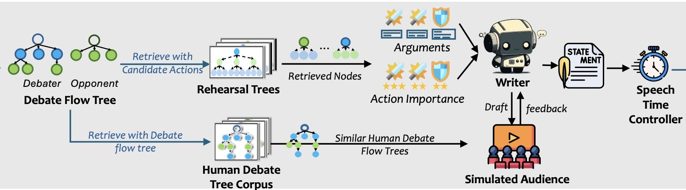

<div align="center">

<h1>TreeDebater</h1>

<p>
<h3>Strategic Planning and Rationalizing on Trees Make LLMs Better Debaters</h3>
<br/>
<a href="https://arxiv.org/abs/2505.14886"><b>📃 Paper</b></a>
|
<a href="https://dqwang122.github.io/debate-evaluation/"><b>🌐 Online Evaluation Platform</b></a>
|
<a href="https://dqwang122.github.io/projects/Debate/"><b>🤗 Project Page</b></a>
</p>

<p>
<a href="https://github.com/yuanteli/debate/actions"></a>


</p>

</div>

## 🌟 Introduction

**TreeDebater** is a competitive debate framework that equips LLM agents with structured reasoning and planning through two complementary tree-based modules:

- **Rehearsal Tree**: performs multi-step simulations of possible attacks and defenses for each claim using a minimax-style strength function, helping estimate robustness and strategic value before allocating limited speaking time.
- **Debate Flow Tree**: maintains the evolving debate graph in real time, tracking argument states and selecting optimal actions (claim, support, attack, rebuttal) based on structural priority and visit frequency.

Together with a simulated audience feedback module and a TTS-based speech-time controller, TreeDebater optimizes decision-making under time constraints, focusing LLMs on the most impactful moves and significantly improving persuasiveness over prior systems.

<p align="center">
  
  <br/>
  <em>The overall framework of TreeDabater</em>
</p>


## ⚡ Quick start

### 🐍 Create a Conda Environment

```bash
conda create -n tree-debater python=3.10 -y
conda activate tree-debater
pip install -r requirements.txt
```

Optional: setup dev tools and common tasks via Makefile.
```bash
make dev        # install lint/test/docs tools
make lint       # run linters (mypy/ruff/isort/black)
```


### 🔊 Install FastSpeech2 for Speech‑Time Estimation
Follow the upstream instructions in [FastSpeech2](https://github.com/ming024/FastSpeech2):
```bash
mkdir -p dependencies
cd dependencies
git clone https://github.com/ming024/FastSpeech2.git
cd FastSpeech2
pip install -r requirements.txt
```
Download the pretrained models and place them under the expected directories, e.g.:
- `dependencies/FastSpeech2/output/ckpt/LJSpeech/`
- `dependencies/FastSpeech2/output/ckpt/AISHELL3/`
- `dependencies/FastSpeech2/output/ckpt/LibriTTS/`

### ⚙️ Configuration: API Keys
Fill in your API keys in `src/configs/api_key.json`. You should also apply for a search API key from [Tavily](https://tavily.com/).

Example `src/configs/api_key.json` (schema example, replace with your keys):
```json
{
  "openai": "sk-...",
  "google": "...",
  "tavily": "tvly-..."
}
```

### 🗂️ Initialize Local Search Database Cache
Before running, create the local database used for caching search results. This will create `.cache/search.db` in the repo root.
```bash
cd src
python -c "import utils.db as db; db.init_db()"
```

### 🧩 Create Evidence Pool
If you plan to use trained reward models, update `SUPPORT_RM_PATH` and `ATTACK_RM_PATH` in `src/utils/constants.py` to point to your models.

If you want to disable reward models and ask the LLM to act as the reward model instead, pass `--ban_rm_model` (default LLM is `gemini-2.0-flash`).

Single motion example:
```bash
cd src
python3 prepare.py \
  --motion "AI will lead to the decline of human creative arts" \
  --save_dir ../results1029 \
  --max_search_depth 4
```

Full motion list example:
```bash
cd src
python3 prepare.py \
  --motion_file ../dataset/motion_list.txt \
  --save_dir ../results1029 \
  --max_search_depth 4
```

Outputs (examples):
- `results1029/gemini-2.0-flash/<motion>_pool_for.json`
- `results1029/gemini-2.0-flash/<motion>_pool_against.json`

Logs are written to `log_files/`.

### 🛠️ Create Debate Configs
Generate configs for End-to-End and Head-to-Head settings:
```bash
cd src/configs
# End-to-end debate configs
python create_config.py \
  --motion_file ../../dataset/motion_list.txt \
  --save_dir test \
  --pool_version 1029 \
  --template base.yml

# Head-to-head debate configs
python create_config.py \
  --motion_file ../../dataset/motion_list.txt \
  --save_dir test \
  --pool_version 1029 \
  --template compare.yml
```

You should see e.g. `test/case1/base_gemini-2.0-flash.yml` and `test/case1/compare_gemini-2.0-flash.yml`. Flipped-stance configs ending with `_re.yml` will also be created.

### ⚔️ Run Debates
```bash
cd src
# End-to-end debate
python env.py --config test/case1/base_gemini-2.0-flash.yml

# Head-to-head debate
python compare_env.py --config test/case1/compare_gemini-2.0-flash.yml
```

Example with DeepSeek config (if created):
```bash
python compare_env.py --config test2/case1/compare_deepseek-chat.yml
```

### 🔊 Streaming TTS (Optional)
By default, the TTS pipeline generates audio serially and trims sentences that exceed the time budget. With `streaming_tts: true` in your config, a **streaming pipeline** is used instead:

- **Chunk-based processing**: the debate speech is split into paragraph-level chunks, each assigned a proportional share of the total time budget (opening: 240s, rebuttal: 240s, closing: 120s).
- **Adaptive refinement**: FastSpeech2 estimates each chunk's duration; if off-target, an LLM rewrites the chunk to hit the target word count. Multiple TTS candidates are submitted in parallel and the closest-to-target is picked.
- **Streaming overlap**: while chunk N plays, chunk N+1 is being refined and TTS-generated, minimizing gaps.
- **No information loss**: instead of trimming sentences, text is rewritten to fit the budget.

To enable, set `streaming_tts: true` in the `env` section of your config:
```yaml
env:
  time_control: true
  streaming_tts: true
```

After a streaming run, each speech produces a `*_chunks/` directory containing per-chunk audio, text, and a `chunk_profile.csv` with timing details. To visualize the overlap timeline:
```bash
bash src/scripts/overlap_viz.sh "log_files/<run>_outputs/*_chunks"
```

### 🤖 Optional: Agent4Debate Backend
If you wish to use Agent4Debate as a baseline or component, install and run its backend server following their documentation:
- Repo: [Agent4Debate](https://github.com/zhangyiqun018/agent-for-debate)
- Typical usage: run `python main.py` in its backend to start the debate server.


## 📚 Citation

If you find this project helpful, please consider citing the following work:

```bibtex
@article{wang2025treedebater,
  title   = {Strategic Planning and Rationalizing on Trees Make LLMs Better Debaters},
  author  = {Danqing Wang and Zhuorui Ye and Xinran Zhao and Fei Fang and Lei Li},
  journal = {arXiv preprint arXiv:2505.14886},
  year    = {2025}
}
```


## 🙏 Acknowledgements

- Baseline implementation and inspiration: [Agent4Debate](https://github.com/zhangyiqun018/agent-for-debate)
- Speech time estimation components: [FastSpeech2](https://github.com/ming024/FastSpeech2)
- We thank all contributors and the broader research community for open-source tools and discussions that made this project possible.
