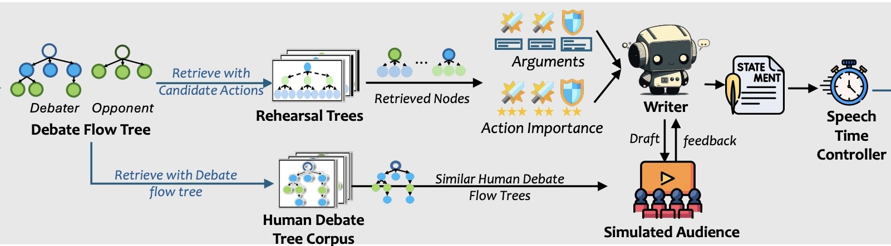

<div align="center">

<h1>TreeDebater</h1>

<p>
<h3>Strategic Planning and Rationalizing on Trees Make LLMs Better Debaters</h3>
<br/>
<a href="https://arxiv.org/abs/2505.14886"><b>📃 Paper</b></a>
|
<a href="https://dqwang122.github.io/debate-evaluation/"><b>🌐 Online Evaluation Platform</b></a>
|
<a href="https://dqwang122.github.io/projects/Debate/"><b>🤗 Project Page</b></a>
</p>

<p>
<a href="https://github.com/yuanteli/debate/actions"></a>


</p>

</div>

## 🌟 Introduction

**TreeDebater** is a competitive debate framework that equips LLM agents with structured reasoning and planning through two complementary tree-based modules:

- **Rehearsal Tree**: performs multi-step simulations of possible attacks and defenses for each claim using a minimax-style strength function, helping estimate robustness and strategic value before allocating limited speaking time.
- **Debate Flow Tree**: maintains the evolving debate graph in real time, tracking argument states and selecting optimal actions (claim, support, attack, rebuttal) based on structural priority and visit frequency.

Together with a simulated audience feedback module and a TTS-based speech-time controller, TreeDebater optimizes decision-making under time constraints, focusing LLMs on the most impactful moves and significantly improving persuasiveness over prior systems.

<p align="center">
  
  <br/>
  <em>The overall framework of TreeDabater</em>
</p>


## ⚡ Quick start

### 🐍 Create a Conda Environment

```bash
conda create -n tree-debater python=3.10 -y
conda activate tree-debater
pip install -r requirements.txt
```

Optional: setup dev tools and common tasks via Makefile.
```bash
make dev        # install lint/test/docs tools
make lint       # run linters (mypy/ruff/isort/black)
```


### 🔊 Install FastSpeech2 for Speech‑Time Estimation
Follow the upstream instructions in [FastSpeech2](https://github.com/ming024/FastSpeech2):
```bash
mkdir -p dependencies
cd dependencies
git clone https://github.com/ming024/FastSpeech2.git
cd FastSpeech2
pip install -r requirements.txt
```
Download the pretrained models and place them under the expected directories, e.g.:
- `dependencies/FastSpeech2/output/ckpt/LJSpeech/`
- `dependencies/FastSpeech2/output/ckpt/AISHELL3/`
- `dependencies/FastSpeech2/output/ckpt/LibriTTS/`

### ⚙️ Configuration: API Keys
Fill in your API keys in `src/configs/api_key.json`. You should also apply for a search API key from [Tavily](https://tavily.com/).

Example `src/configs/api_key.json` (schema example, replace with your keys):
```json
{
  "openai": "sk-...",
  "google": "...",
  "tavily": "tvly-..."
}
```

### 🗂️ Initialize Local Search Database Cache
Before running, create the local database used for caching search results. This will create `.cache/search.db` in the repo root.
```bash
cd src
python -c "import utils.db as db; db.init_db()"
```

### 🧩 Create Evidence Pool
If you plan to use trained reward models, update `SUPPORT_RM_PATH` and `ATTACK_RM_PATH` in `src/utils/constants.py` to point to your models.

If you want to disable reward models and ask the LLM to act as the reward model instead, pass `--ban_rm_model` (default LLM is `gemini-2.0-flash`).

Single motion example:
```bash
cd src
python3 prepare.py \
  --motion "AI will lead to the decline of human creative arts" \
  --save_dir ../results1029 \
  --max_search_depth 4
```

Full motion list example:
```bash
cd src
python3 prepare.py \
  --motion_file ../dataset/motion_list.txt \
  --save_dir ../results1029 \
  --max_search_depth 4
```

Outputs (examples):
- `results1029/gemini-2.0-flash/<motion>_pool_for.json`
- `results1029/gemini-2.0-flash/<motion>_pool_against.json`

Logs are written to `log_files/`.

Claim grouping defaults to `--clustering_method semantic`. The configured LLM groups
claims by shared contention and causal mechanism, with `--max_claim_groups 10` as
a hard cap per side. It writes a grounded common root for each multi-claim group
and retains every original member. Valid singletons retain their source text;
being alone or verbatim is never a reason to reject a group.

A separate same-model request reviews every group and records each member's mechanism,
connection to the root, and whether it fits. A negative fit requires a concrete issue.
Issues must identify source
members, their mechanism, the group's mechanism, a concrete mismatch, and a repair
action. Moves/merges must name a target group and explain the mechanism fit.
Semantic issues trigger a local replacement of only the affected groups (including
explicit move/merge targets); the repair request receives only those groups and their
source members, with allowed IDs listed explicitly. Unaffected groups remain unchanged. Partition coverage,
unique source IDs, and the group cap are rechecked before reviewing the result.

There are at most three semantic review rounds. Proposal, review, and local-repair
responses each have a separate limit of three format/contract attempts. A malformed
review retries only that review on the same partition, with the invalid response and
validation error in the retry prompt. It never triggers a fresh grouping. Exhausted
format attempts or unresolved semantic issues stop preparation before any trees are
built. `initial_proposal` in the Python helper validates and reviews an existing saved
partition without regenerating it.

`*_pool_<side>_clustering.json` records phase-tagged calls, validation failures,
review issues, affected groups, before/after partitions, and acceptance status.
Synthetic roots carry `synthetic_group_root`, `source_claim_ids`, and coverage
metadata. Their initial strength is the maximum source strength, explicitly marked
as inherited; tree evaluation scores the root afterward. Same-model review is a
consistency check, not independent factual validation or a guarantee of semantic quality.

`--clustering_method agglomerative` retains the embedding-only alternative using
`claim + explanation`, average-linkage cosine similarity, and
`--cluster_similarity_threshold 0.8`. It enforces the same cap and records forced
merges and embeddings in its audit. This method can mix unrelated topics to meet
the cap; semantic mode does not silently fall back to it.

In each TreeDebater YAML entry, `claim_pool_limit: 10` controls the number of
candidate groups used for main-claim selection (previously fixed at 8), and the
construction cap when generating pools on demand. Complete loaded rehearsal pools
remain available for retrieval. Use a new preparation output directory when changing
clustering settings: existing pool files are still skipped.

Rehearsal retrieval defaults to `rehearsal_mode: hybrid`. It combines a separate
index of the claim being answered with material text, using lexical matching and
a resident local sentence encoder. The default model is
`sentence-transformers/all-MiniLM-L6-v2` (`rehearsal_local_model`); its files must
already exist locally or in the Hugging Face cache. Loading never downloads a
model or falls back to an API. Missing files produce an error; set
`rehearsal_mode: local` for the model-free lexical/cache-only alternative.

Claim selection preloads both rehearsal pools and encodes their materials. This
preparation can take seconds and is outside the steady-state retrieval budget.
A caller skipping preparation pays that startup cost on its first lookup. New
queries are encoded locally in a CPU worker with `rehearsal_encoder_threads: 2`;
the worker does not change the debate process's Torch thread settings. Model
vectors are kept separate from existing API embedding caches. Text changes rebuild
the affected index, and stale nodes and cached negative verdicts remain excluded.

`rehearsal_local_min_score: 0.25` and `rehearsal_semantic_min_score: 0.35` are
lexical/semantic admission thresholds; `rehearsal_candidate_k: 20` and
`rehearsal_max_results: 3` cap selection. The thresholds are initial defaults,
not calibrated quality guarantees. Experimental `rehearsal_max_per_anchor: 1`
limits unverified replies to one per normalized parent claim across both pools;
`null` (the default) preserves the fully graded baseline. Grounded positive cached
verdicts are exempt from this diversity limit. This can replace useful sibling
responses as well as irrelevant ones, so new outputs require separate evaluation. Similarity ranks candidates; it does not prove
that a reply supports or challenges the current target. Obvious polarity checks
and exact-context cached verdicts still apply. Set `rehearsal_mode: llm` to opt
into the slower, billable semantic-validation path. These settings affect rehearsal
lookup only, not debate generation latency.

### 🛠️ Create Debate Configs
Generate configs for End-to-End and Head-to-Head settings:
```bash
cd src/configs
# End-to-end debate configs
python create_config.py \
  --motion_file ../../dataset/motion_list.txt \
  --save_dir test \
  --pool_version 1029 \
  --template base.yml

# Head-to-head debate configs
python create_config.py \
  --motion_file ../../dataset/motion_list.txt \
  --save_dir test \
  --pool_version 1029 \
  --template compare.yml
```

You should see e.g. `test/case1/base_gemini-2.0-flash.yml` and `test/case1/compare_gemini-2.0-flash.yml`. Flipped-stance configs ending with `_re.yml` will also be created.

### ⚔️ Run Debates
```bash
cd src
# End-to-end debate
python env.py --config test/case1/base_gemini-2.0-flash.yml

# Head-to-head debate
python compare_env.py --config test/case1/compare_gemini-2.0-flash.yml
```

Example with DeepSeek config (if created):
```bash
python compare_env.py --config test2/case1/compare_deepseek-chat.yml
```

### 🔊 Streaming speech and listening

The current listening pipeline prepares a reviewed first paragraph while the
opponent speaks, then revises the remaining body using the complete transcript.
See [the streaming guide](src/streaming/README.md) for modes, configuration,
concurrency, timing and tests.

The fixed experimental reference is
[v70-20261010](experiments/incremental_planning/baselines/v70-20261010/baseline.json).
Its source archive remains unchanged during cleanup. It covers the server-paced
motion harness; it is not a web application acceptance result.

Historical experiments are preserved in
[development notes](docs/history/streaming-development.md) and
[the experiment journal](docs/history/process.md).

### 🤖 Optional: Agent4Debate Backend
If you wish to use Agent4Debate as a baseline or component, install and run its backend server following their documentation:
- Repo: [Agent4Debate](https://github.com/zhangyiqun018/agent-for-debate)
- Typical usage: run `python main.py` in its backend to start the debate server.


## 📚 Citation

If you find this project helpful, please consider citing the following work:

```bibtex
@article{wang2025treedebater,
  title   = {Strategic Planning and Rationalizing on Trees Make LLMs Better Debaters},
  author  = {Danqing Wang and Zhuorui Ye and Xinran Zhao and Fei Fang and Lei Li},
  journal = {arXiv preprint arXiv:2505.14886},
  year    = {2025}
}
```


## 🙏 Acknowledgements

- Baseline implementation and inspiration: [Agent4Debate](https://github.com/zhangyiqun018/agent-for-debate)
- Speech time estimation components: [FastSpeech2](https://github.com/ming024/FastSpeech2)
- We thank all contributors and the broader research community for open-source tools and discussions that made this project possible.
